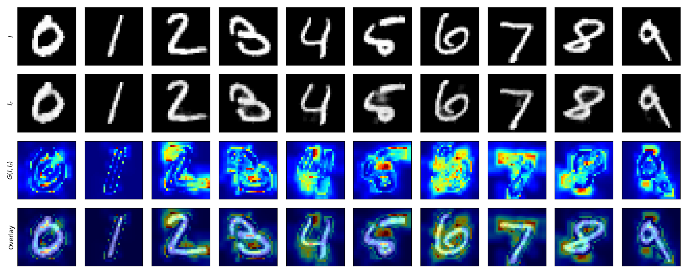

[PyTorch] Reconstruction by inpainting for visual anomaly detection (RIAD)
=====
PyTorch implementation of "Reconstruction by inpainting for visual anomaly detection (RIAD)"

## Concept

  
  
Concept ot the RIAD [1].

### Model

  

### Training Strategy

#### Overal Procedure

#### Preprocessing

#### Inference and Postprocessing

## Experiments

### Preparing for Disjoint Masking

#### Input (Given)
   

#### Set of disjoint masks
   
Disjoint masks with $k=\{2, 4\}$.  
First and second row shows the mask of $k=2$ and $k=4$ respectively.  
Each column shows the $i$-$th$ mask for each cell size $k$.  

#### Set of mask applied input
   

### Anomaly Detection using MNIST dataset

#### Setting
  * Normal (Good): 1
  * Abnormal (Not-good): 0, 2, 3, 4, 5, 6, 7, 8, 9 (other than 1)

#### Results
<strong>Loss convergence</strong>  
   

<strong>Reconstruction</strong>  
   

<strong>Anomaly detection performance (w/ validation set)</strong>  
   

<strong>Result of training: result.json (w/ test set)</strong>  

  
root
  

name_best:"model_2_best_auroc.pth"  
auroc:0.9974551381667722  
loss:0.0017763811201996548  
select_norm:1  
masking_mode:"disjoint_mask"  
disjoint_n:3  
nn:2000  
dim_h:28  
dim_w:28  
dim_c:1  
ksize:3  
mode_optim:"adam"  
learning_rate:0.001  
mode_lr:0  
path_ckpt:"Checkpoint"  
ngpu:1  
device:"cuda"  
filters:"[1, 64, 128, 256, 512]"  

## Requirements
* PyTorch 1.11.0

## Reference
[1] Vitjan Zavrtanik et al. <a href="https://www.sciencedirect.com/science/article/pii/S0031320320305094">"Reconstruction by inpainting for visual anomaly detection."</a> Pattern Recognition, vol. 112, 2021.
